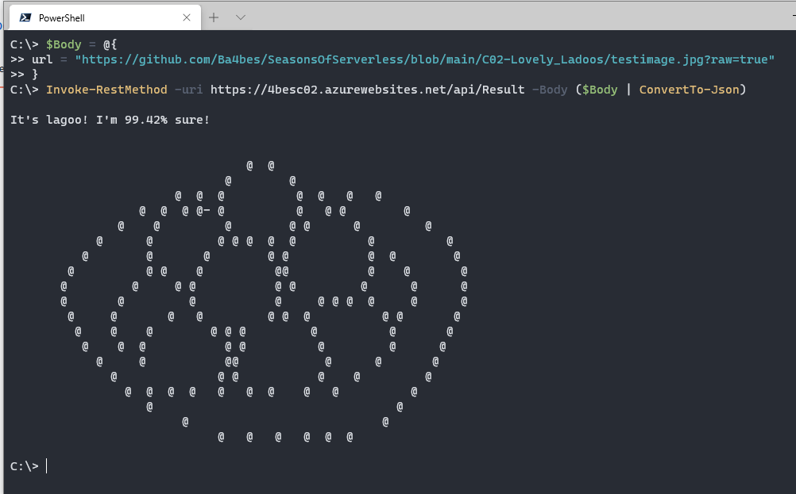

# Challenge 2: Lovely Ladoos

## Solution

If you had given me this challenge last year, I wouldn't even have started, as I know nothing about AI.
But attending talks by [Henk Boelman](https://twitter.com/hboelman) and [Willem Meints](https://twitter.com/willem_meints) gave me the confidence that maybe AI isn't so scary. And then the tweet by [Marc Duiker](https://twitter.com/marcduiker/status/1333375872678637568) helped me jump right in.

So I created the AI part with [this guide](https://docs.microsoft.com/en-us/azure/cognitive-services/Custom-Vision-Service/getting-started-build-a-classifier). I created a set with Ladoos, a set with gumballs and inspired by Marc (who was using bitterballs), I used another Dutch treat: [the oliebol](https://en.wikipedia.org/wiki/Oliebol).

I think the results were pretty good.


Then I made a PowerShell Function, of course :).
And I spend the extra time to create the ascii art myself this time

## Try it yourself

The function is designed to be called from a interactive prompt, with a body for the URL

You can try it yourself:

```PowerShell
$Body = @{
    url = "https://media1.tenor.com/images/eacb79bb101877334ffe72f595724d8b/tenor.gif?itemid=14606527"
}

Invoke-RestMethod -uri https://4besc02.azurewebsites.net/api/Result -Body ($Body | ConvertTo-Json)

```



Created by Barbara Forbes
<https://4bes.nl>

## The Challenge

This challenge is part of the Seasons of serverless: <https://github.com/microsoft/Seasons-of-Serverless>

original challenge ([source](https://github.com/microsoft/Seasons-of-Serverless/blob/main/Nov-30-2020.md))


# Challenge 2: Lovely Ladoos 

 Your Chefs: Jasmine Greenaway, Cloud Advocate (Microsoft) with Soumya Narapaju and Aditya Raman, Microsoft Student Ambassadors

## This week's featured region: India

It's Diwali season in India! Diwali is a festival that celebrates the victory of light over darkness. Families celebrate with fireworks and light up every house in the country with diyas, a type of Indian candles. A very popular delicacy that Indians eat during Diwali is ladoos.

Ladoos are balls of flour dipped in sugar syrup. Since we're in the middle of a global pandemic, most of the celebrations have to be done from home and we have to be innovative to find our inner child to have fun during Diwali 2020. Thanks to technology, however, we're still connected to our loved ones virtually!
## Your challenge 🍽
 
Create a machine learning model that can analyze images of ladoos made for Diwali. This way, folks can upload an image of their ladoos and see how well the model predicts whether they are a proper ladoo. You'll want to create a serverless function to handle image uploads to test the model. You'll also need a dataset of ladoos, and we've added some in [this folder](/graphics/ladoo-dataset), but make sure to train on other types of sweets like doughnut holes, for comparison. Tip: use a [browser extension](https://chrome.google.com/webstore/detail/download-all-images/nnffbdeachhbpfapjklmpnmjcgamcdmm) to scrape the web for more images. Your ladoo model will serve as a judge to your skill in making ladoos. This is a playful way to channel your inner child for Diwali!

## Resources/Tools Used 🚀

-   **[Visual Studio Code](https://code.visualstudio.com/?WT.mc_id=academic-10922-cxa)**
-   **[Postman](https://www.getpostman.com/downloads/)**
-   **[Azure Functions Extension](https://marketplace.visualstudio.com/items?itemName=ms-azuretools.vscode-azurefunctions&WT.mc_id=academic-10922-cxa)**

## Next Steps 🏃

Learn more about serverless!

  ✅ **[Serverless Free Courses](https://docs.microsoft.com/learn/browse/?term=azure%20functions&WT.mc_id=academic-10922-cxa)**

## Important Resources ⭐️

  ✅ **[Azure Functions documentation](https://docs.microsoft.com/azure/azure-functions/?WT.mc_id=academic-10922-cxa)**
  
  ✅ **[Azure SDK for JavaScript Documentation](https://docs.microsoft.com/azure/javascript/?WT.mc_id=academic-10922-cxa)**
  
  ✅ **[Create your first function using Visual Studio Code](https://docs.microsoft.com/azure/azure-functions/functions-create-first-function-vs-code?WT.mc_id=academic-10922-cxa)**
  
  ✅ **[Free E-Book - Azure Serverless Computing Cookbook, Second Edition](https://azure.microsoft.com/resources/azure-serverless-computing-cookbook/?WT.mc_id=academic-10922-cxa)**

## Ready to submit a solution to this challenge? Here's how 🚀 

Open an [issue](https://github.com/microsoft/Seasons-of-Serverless/issues/new?assignees=&labels=&template=seasons-of-serverless-solution.md&title=Solution) in this repo, with a link to your challenge and a brief explanation of how you solved it. We will take a look, approve it if appropriate, and a tag with the appropriate week. If your solution is picked as a weekly standout solution, we'll send you a little prize!
