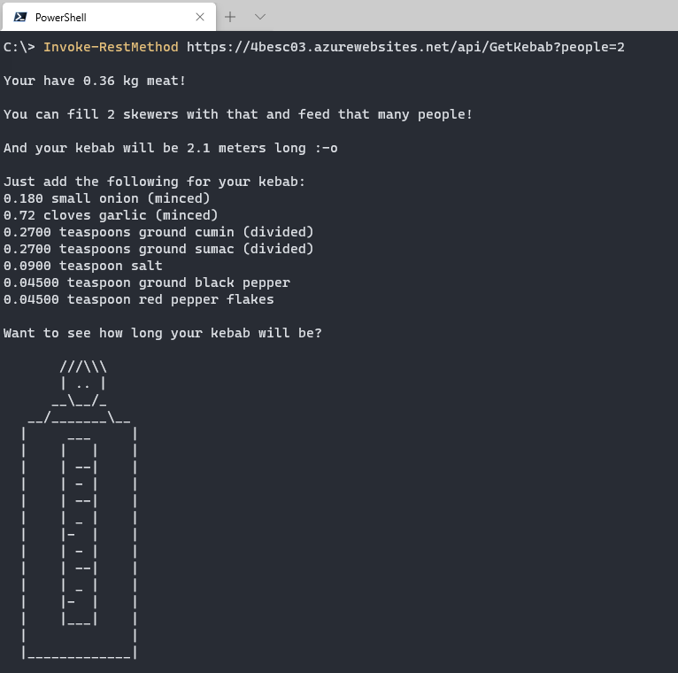

# Challenge 3: The Longest Kebab

## Solution

This is a PowerShell function App, of course.

The first challenge was to get the right information. How many people can you feed of a kebab? How long is a kebab? And how much does it weight?

I based my information on  [wikipedia](https://en.wikipedia.org/wiki/Adana_kebab%C4%B1)

>After reaching homogeneity, the mixture is placed on iron skewers that are 0.5 cm thick, 3 cm wide and anywhere from 90 to 120 cm long. One portion of Adana kebabı is typically 180 grams of meat on one skewer. A "portion-and-half", impaled on slightly wider skewers can not include less than 270 grams, as per the designation label.[3]

This means that one kebab skewer can feed one person and is 180 grams of meat. For the length I took the middle value, 105 cm.

The other information is based on the recipe in the challenge.

Now the following challenge was to make this a calculator.
I made the function so it can take a weight, an amount of persons or a length. It will calculate all the other values from that.

And most importantly: The ascii art! 
The Ascii art of the kebab will get longer as the length of the kebab grows <3


## Try it yourself

The function is designed to be called from a interactive prompt, but also works in a browser.

You can try it yourself:

```PowerShell
Invoke-RestMethod https://4besc03.azurewebsites.net/api/GetKebab?people=5
```

```PowerShell
Invoke-RestMethod https://4besc03.azurewebsites.net/api/GetKebab?weight=20
```

```PowerShell
Invoke-RestMethod https://4besc03.azurewebsites.net/api/GetKebab?length=5
```



Created by Barbara Forbes  
<https://4bes.nl>

## The Challenge

_Your Chefs: Cecil Phillip, Cloud Advocate (Microsoft) with Baris Ceviz, Microsoft Student Ambassador_

## This week's featured region: Turkey

`Adana kebabı` or 'kebab' is a traditional meal, eaten in many religious and national holidays in Turkey. "It's a long, hand-minced meat kebab mounted on a wide iron skewer and grilled on an open `mangal` or grill filled with burning charcoal. The culinary item is named after Adana, the fifth largest city of Turkey" [source](https://en.wikipedia.org/wiki/Adana_kebab%C4%B1). In the city of Adana, festivals are held with a competition centered around who can make the longest kebab in the world. At the festival, people have fun and eat this delicious dish!


> A [233 meter kebab](https://www.youtube.com/watch?v=yj4FADNGhMY&ab_channel=ShowAnaHaber)!
## Your challenge 🍽 

The most common problem in this festival is calculating how much material is needed to create the longest possible kebab based on the amount of material you have on hand. Since there are so many people at the festival, and you'd like to serve them all, the materials must be calculated quickly.

You need to produce a fast serverless solution to this problem. Create a **kebab calculator** that, given a certain amount of meat in kilos, can calculate how many people you'll be able to feed as well as how long your kebab can be!

Keep in mind that kebabs aren't only made of meat! Here's a [recipe](https://www.thespruceeats.com/adana-kebab-4164647) that you can work with:

- 2 kilos ground lamb
- 1 small onion (minced)
- 4 cloves garlic (minced)
- 1 1/2 teaspoons ground cumin (divided)
- 1 1/2 teaspoons ground sumac (divided)
- 1/2 teaspoon salt
- 1/4 teaspoon ground black pepper
- 1/4 teaspoon red pepper flakes

With your fast calculator, you might be able to win the prize for the longest kebab!
## Resources/Tools Used 🚀

-   **[Visual Studio Code](https://code.visualstudio.com/?WT.mc_id=academic-10922-cxa)**
-   **[Postman](https://www.getpostman.com/downloads/)**
-   **[Azure Functions Extension](https://marketplace.visualstudio.com/items?itemName=ms-azuretools.vscode-azurefunctions&WT.mc_id=academic-10922-cxa)**

## Next Steps 🏃

Learn more about serverless!

  ✅ **[Serverless Free Courses](https://docs.microsoft.com/learn/browse/?term=azure%20functions&WT.mc_id=academic-10922-cxa)**

## Important Resources ⭐️

  ✅ **[Azure Functions documentation](https://docs.microsoft.com/azure/azure-functions/?WT.mc_id=academic-10922-cxa)**
  
  ✅ **[Azure SDK for JavaScript Documentation](https://docs.microsoft.com/azure/javascript/?WT.mc_id=academic-10922-cxa)**
  
  ✅ **[Create your first function using Visual Studio Code](https://docs.microsoft.com/azure/azure-functions/functions-create-first-function-vs-code?WT.mc_id=academic-10922-cxa)**
  
  ✅ **[Free E-Book - Azure Serverless Computing Cookbook, Second Edition](https://azure.microsoft.com/resources/azure-serverless-computing-cookbook/?WT.mc_id=academic-10922-cxa)**

## Ready to submit a solution to this challenge? Here's how 🚀 

Open an [issue](https://github.com/microsoft/Seasons-of-Serverless/issues/new?assignees=&labels=&template=seasons-of-serverless-solution.md&title=Solution) in this repo, with a link to your challenge and a brief explanation of how you solved it. We will take a look, approve it if appropriate, and a tag with the appropriate week. If your solution is picked as a weekly standout solution, we'll send you a little prize!
