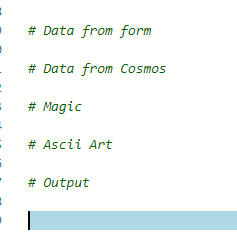
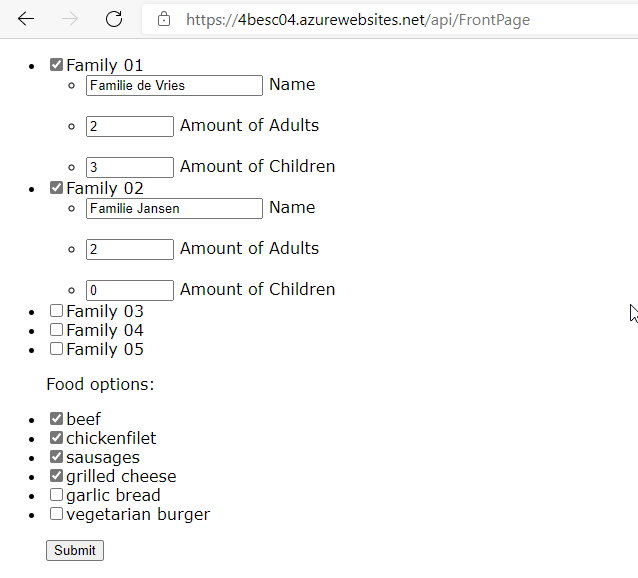
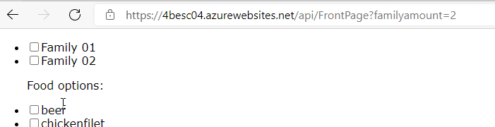
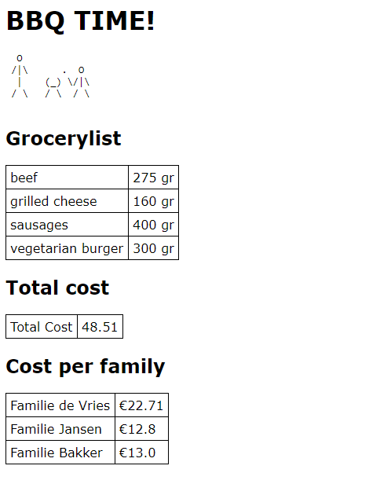
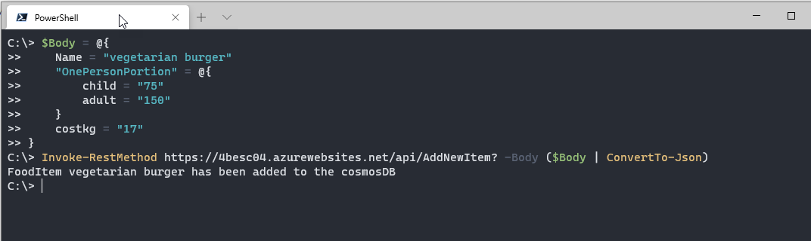

# Challenge 4: A Big Barbecue!

I love you guys, but that is one of the most confusing spreadsheets I have ever seen :-o.
That might be because there is so much information in a table format. This calls for semi-structured data! And gives me a chance to work with CosmosDB again.

## The process

The assignment confused me a bit as well. What input was I looking for and what output?  
So I did what I often do when the process gets confusing: I made a drawing on my iPad.


So, some clarity, awesome!

Next, I created all the functions that I would need, so I could add the code later.  
At this point, my functions are filled in like this:




### The food items

I got information for the food items on the internet and made a function (AddnewItem) to enter them into the database.  
The items can be found in zfooditems.json and the way I entered in the database in zcreateinput.ps1

### the form

For the form I needed flexibility, as the food items might change and the amount of families might change. I build that in through PowerShell. The form itself is simple HTML, with some trics straight from StackOverflow.

### The result

The result is where all calculations happen. After that all these new results are put into an HTML output. Since everything got so complicated, the ASCII art for this is really simple. An adult and a child holding a marshmallow over a bbq :).

## Using the app

### Opening the form

The form can be called in a webbrowser with the following URL: <https://4besc04.azurewebsites.net/api/FrontPage>

When a family is ticked, a few more options pop up.



By selecting more or less food, the caller can play around with the budget

If more families (or less) are needed, you can use the parameter ```familyamount``` to change the amount of families you can fill in.



When the form is submitted, the output will show ascii art, a grocery list, the total cost and the cost for each family




## Adding or changing food items

There is a small database of food items available, but maybe you want some more options. Or the prices change. To enable that, a function is available to update the database. This can be called with the following code:

```PowerShell

$Body = @{
    Name = "vegetarian burger"
    "OnePersonPortion" = @{
        child = "75"
        adult = "150"
    }
    costkg = "17"
}

Invoke-RestMethod https://4besc04.azurewebsites.net/api/AddNewItem? -Body ($Body | ConvertTo-Json)

```



## The Challenge

This challenge is part of the Seasons of serverless: <https://github.com/microsoft/Seasons-of-Serverless>

original challenge ([source](https://github.com/microsoft/Seasons-of-Serverless/blob/main/Dec-14-2020.md))

*Your Chefs: Lucas Santos, Cloud Advocate, Microsoft, with Rogerio Rodrigues and Sydney Cirqueira, Microsoft Student Ambassadors, with special help from Lucas's Super-BBQ-Chef father*

## This week's featured region: Brazil

In Brazil, everyone loves a big barbecue! Brazilian barbecue is justifiably famous. Everyone's friends and family gets together for a feast, complete with grilled meats called churrasco, typically beef with different marinades. You can also find prime rib, linguica (a kind of sausage), lamb kebabs, chicken legs, fish, and much more. 

Some families have created whole systems to help organize the amount of food needed for the number of people invited to a big barbecue. We have gained access to a spreadsheet used to organize large family barbecues: [here it is](graphics/bbq-spreadsheet.xlsx).

Big events like this can get expensive, and you need to stay in within your budget. The spreadsheet used here is an example that you can use as a starting point to determine how many people will attend the barbecue, how much food will be needed, and how much it will cost. The excel file is still lacks some data, such as prices for food, but you can use your own local prices and estimates.

## Your challenge 🍽 

Using the spreadsheet as inspiration, create a serverless method of determining how many people you can invite based on a given budget (you can determine your budget and currency). Can you invite more people if you serve less fillet and more grilled cheese? Show us a good solution to create a really big BBQ!

## Resources/Tools Used 🚀

-   **[Visual Studio Code](https://code.visualstudio.com/?WT.mc_id=academic-10922-cxa)**
-   **[Postman](https://www.getpostman.com/downloads/)**
-   **[Azure Functions Extension](https://marketplace.visualstudio.com/items?itemName=ms-azuretools.vscode-azurefunctions&WT.mc_id=academic-10922-cxa)**

## Next Steps 🏃

Learn more about serverless!

  ✅ **[Serverless Free Courses](https://docs.microsoft.com/learn/browse/?term=azure%20functions&WT.mc_id=academic-10922-cxa)**

## Important Resources ⭐️

  ✅ **[Azure Functions documentation](https://docs.microsoft.com/azure/azure-functions/?WT.mc_id=academic-10922-cxa)**
  
  ✅ **[Azure SDK for JavaScript Documentation](https://docs.microsoft.com/azure/javascript/?WT.mc_id=academic-10922-cxa)**
  
  ✅ **[Create your first function using Visual Studio Code](https://docs.microsoft.com/azure/azure-functions/functions-create-first-function-vs-code?WT.mc_id=academic-10922-cxa)**
  
  ✅ **[Free E-Book - Azure Serverless Computing Cookbook, Second Edition](https://azure.microsoft.com/resources/azure-serverless-computing-cookbook/?WT.mc_id=academic-10922-cxa)**

## Ready to submit a solution to this challenge? Here's how 🚀 

Open an [issue](https://github.com/microsoft/Seasons-of-Serverless/issues/new?assignees=&labels=&template=seasons-of-serverless-solution.md&title=Solution) in this repo, with a link to your challenge and a brief explanation of how you solved it. We will take a look, approve it if appropriate, and a tag with the appropriate week. If your solution is picked as a weekly standout solution, we'll send you a little prize!
## Credits

<a href="https://www.vecteezy.com/free-vector/meal">Meal Vectors by Vecteezy</a>
