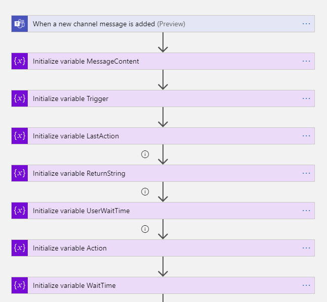
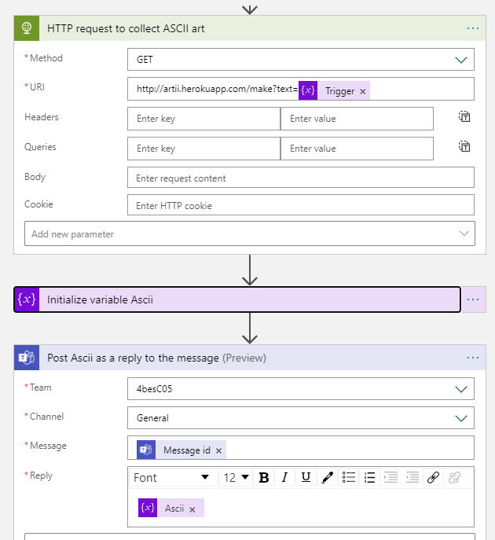
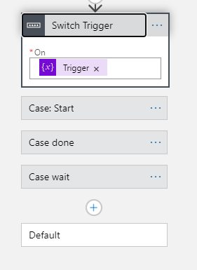
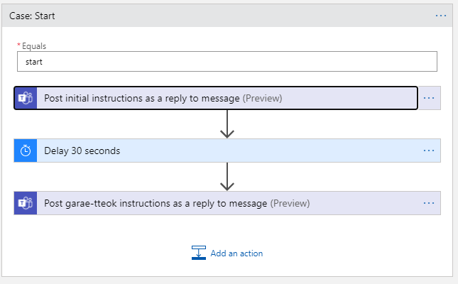
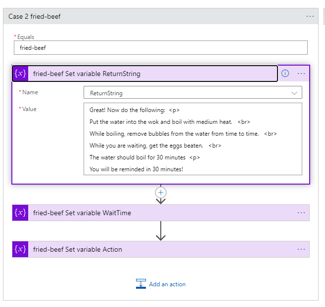
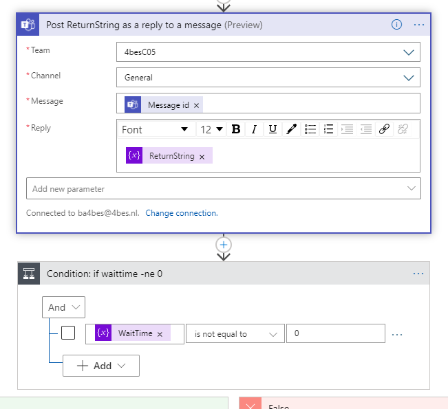
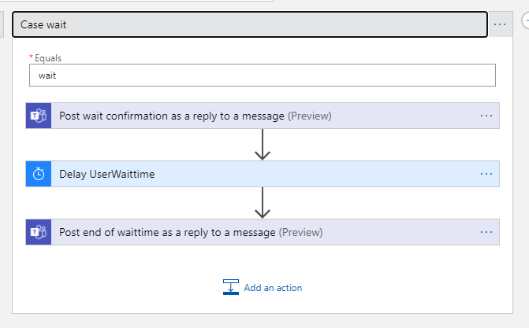
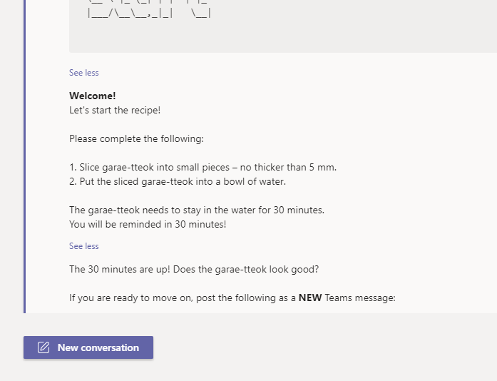
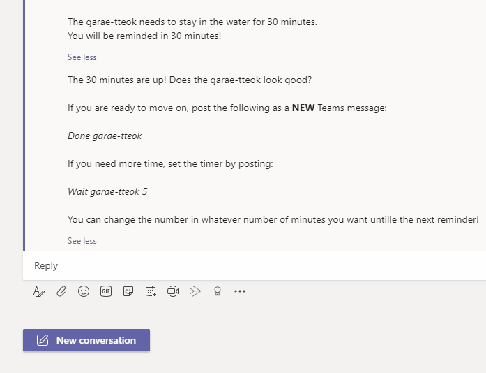
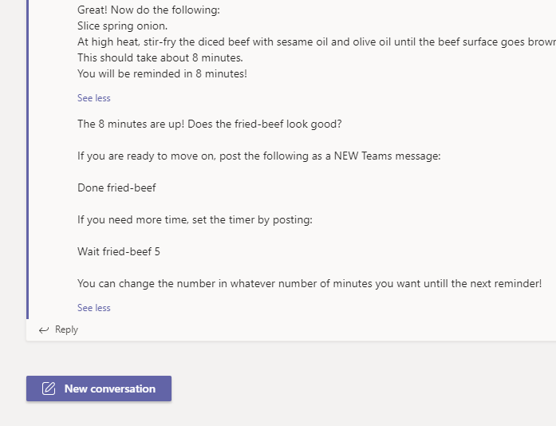

# Challenge 05: Tteok-guk for The New Year

No PowerShell this time! 😲  
For delays, I find Logic Apps are by far the best solution. So I started planning.

## Microsoft Teams

I decided I would connect the Logic App to a Teams channel. This way, you are able to post a message and get replies directly.
Luckily I have written a blog post recently about Logic Apps & Microsoft Teams (and ASCII art!). You can find it on [4bes.nl](https://4bes.nl/2020/10/18/respond-to-a-teams-message-with-a-logic-app/).

## Logic

I took some time to figure out the most efficient way to put all actions in the logic app. I think I found a nice way. I have entered the code in this repository, but I created all the steps in the virtual designer.

The goal I had set was to set triggers based on a message that can be posted. The functionality would be to be able to start the recipe, to confirm you are done with a step or to ask for extra time to wait. This way I can capture the whole process with minimum effort.

## Steps

I will try to show how the logic app works

> Note: for testing purposes, I have set all the delays to seconds instead of minutes.

### Set the variables

First, all the variables are initialized based on the input. I made use of expressions where the input is split and set to lower characters. Some of these will fail, which is by design. So these steps are set to continue on failure.

### ASCII art

I let go of PowerShell, can't let go of ASCII art! I made use of the ASCII Art API to change text into ASCII art. So the API is called to get an ascii art representation of the trigger. It is directly returned to the user.

### Switch the trigger

There are now three different steps, based on the trigger: Start, Done and Wait. This is done with a switch

### Start

This switch is to start the recipe.

First it give instructions. The first delay is started to keep the sliced garae-tteok in water. After that, instructions are given to go on (by using *Done garae-tteok*) or to ask for more time (by using *Wait garae-tteok 5*)

### Done

By using done, you can move on from one step to another step.
Underneath it is a switch to set some variables based on on what stage of the recipe you are

After that, the results are posted to Teams. If a delay is still needed (which is not true for the last step), it is added through a condition

### Wait

With wait, a new delay is set based on a user input. After that the user can choose how to continue

## See it in action

So how does it all look? Time for some gifs!

> Note: I have shortened the wait time for obvious reasons :)

First, let start the recipe.

Let's say we are ready for the next step

We can move through the recipe this way. Let's say we are at the next step but need some extra time.

## Known issues

- The logic apps reaction is not always instantly. It doesn't seem to matter at what interval it checks, sometimes it can take up to 3 minutes for the logic app to respond to the first message. The wait time is always correct though
- Formatting is pretty strict. The logic app will sometimes fail if the text is copy-pasted. Errorhandling is in place to catch this.

## The Challenge

This challenge is part of the Seasons of serverless: <https://github.com/microsoft/Seasons-of-Serverless>

original challenge ([source](https://github.com/microsoft/Seasons-of-Serverless/blob/main/Dec-21-2020.md))

Your Chefs: Justin Yoo (Cloud Advocate, Microsoft) and You Jin Kim, Hong Min Kim and Aaron Roh (Microsoft Student Ambassadors)

## This week's featured region: Korea

In Korea, when New Year begins, everyone eats tteok-guk (rice cake soup). There are various shapes of tteok, but especially for greeting New Year, garae-tteok is the most popular to make the soup.

As garae-tteok has a long and cylindrical shape, people wish to live long, by eating tteok-guk. When cooking tteok-guk, the garae-tteok is sliced into small pieces, which look like coins. This coin-like shape is believed to bring wealth.

> [Image credit](https://blog.naver.com/cjstar1/220918926273)

### Ingredients (for 4 people)

- Garae-tteok: 400g
- Diced beef: 100g
- Water: 10 cups
- Eggs: 2
- Spring onion: 1
- Minced garlic: 1 tablespoon
- Soy sauce: 2 tablespoon
- Sesame oil: 1 tablespoon
- Olive oil: 1 tablespoon
- Salt and pepper

### Recipe

1. Slice garae-ttok into small pieces – no thicker than 5 mm.
   - You can buy sliced garae-tteok.
   - But in this case, put the sliced garae-tteok into a bowl of water for about 30 mins.
2. Slice spring onion.
3. At high heat, stir-fry the diced beef with sesame oil and olive oil until the beef surface goes brown.
4. Put the water into the wok and boil for about 30 mins with medium heat.
5. While boiling, remove bubbles from the water from time to time.
6. Get the eggs beaten.
7. After the 30 mins, put the minced garlic and soy sauce into the boiled soup. Add some salt, if necessary.
8. Add the beaten egg and sliced spring onion.
9. Serve the soup with pepper drizzled on top.

## Your challenge 🍽 

This recipe calls for several steps, and we want to create an automated process to set reminders for each step. For example, if you buy the sliced garae-tteok, you should wait for 30 mins for them to soak. Make sure that the stir-fried beef goes brown in 8 mins but it may take longer than that! And don't let anything burn! This is a good opportunity to try [Azure Functions](https://azure.microsoft.com/services/functions/?WT.mc_id=academic-10922-cxa), [Azure Durable Functions](https://docs.microsoft.com/azure/azure-functions/durable/durable-functions-overview?tabs=csharp&WT.mc_id=academic-10922-cxa), [Azure Queue Storage](https://azure.microsoft.com/services/storage/queues/?WT.mc_id=academic-10922-cxa), [Azure Service Bus](https://azure.microsoft.com/services/service-bus/?WT.mc_id=academic-10922-cxa), [Azure Event Grid](https://azure.microsoft.com/services/event-grid/?WT.mc_id=academic-10922-cxa), [Power Platform](https://powerplatform.microsoft.com/?WT.mc_id=academic-10922-cxa) or something else!

## Resources/Tools Used 🚀

- **[Visual Studio Code](https://code.visualstudio.com/?WT.mc_id=academic-10922-cxa)**
- **[Postman](https://www.getpostman.com/downloads/)**
- **[Azure Functions Extension](https://marketplace.visualstudio.com/items?itemName=ms-azuretools.vscode-azurefunctions&WT.mc_id=academic-10922-cxa)**

## Next Steps 🏃

Learn more about serverless!

  ✅ **[Serverless Free Courses](https://docs.microsoft.com/learn/browse/?term=azure%20functions&WT.mc_id=academic-10922-cxa)**

## Important Resources ⭐️

  ✅ **[Azure Functions documentation](https://docs.microsoft.com/azure/azure-functions/?WT.mc_id=academic-10922-cxa)**
  
  ✅ **[Azure SDK for JavaScript Documentation](https://docs.microsoft.com/azure/javascript/?WT.mc_id=academic-10922-cxa)**

  ✅ **[Azure SDK for Java Documentation](https://docs.microsoft.com/azure/developer/java/?WT.mc_id=academic-10922-cxa)**
  
  ✅ **[Azure SDK for .NET Documentation](https://docs.microsoft.com/dotnet/azure/?WT.mc_id=academic-10922-cxa)**
  
  ✅ **[Azure SDK for Python Documentation](https://docs.microsoft.com/azure/developer/python/?WT.mc_id=academic-10922-cxa)**

  ✅ **[Create your first function using Visual Studio Code](https://docs.microsoft.com/azure/azure-functions/functions-create-first-function-vs-code?WT.mc_id=academic-10922-cxa)**

  ✅ **[Power Platform Documentation](https://docs.microsoft.com/power-platform/?WT.mc_id=academic-10922-cxa)**
  
  ✅ **[Free E-Book - Azure Serverless Computing Cookbook, Second Edition](https://azure.microsoft.com/resources/azure-serverless-computing-cookbook/?WT.mc_id=academic-10922-cxa)**

## Ready to submit a solution to this challenge? Here's how 🚀 

Open an [issue](https://github.com/microsoft/Seasons-of-Serverless/issues/new?assignees=&labels=&template=seasons-of-serverless-solution.md&title=Solution) in this repo, with a link to your challenge and a brief explanation of how you solved it. We will take a look, approve it if appropriate, and a tag with the appropriate week. If your solution is picked as a weekly standout solution, we'll send you a little prize!
