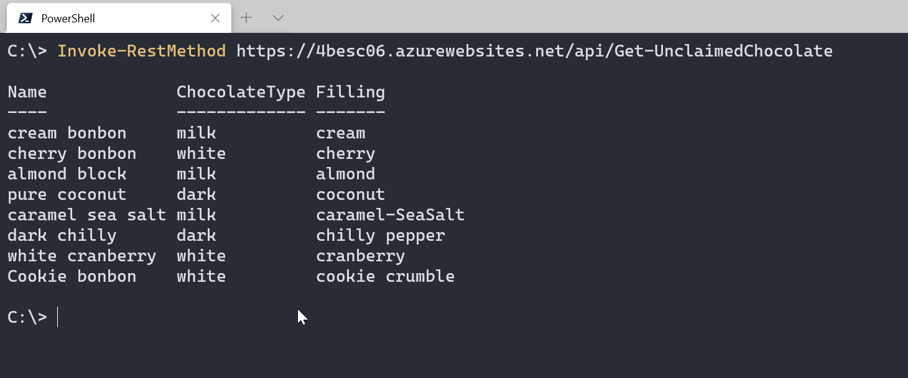
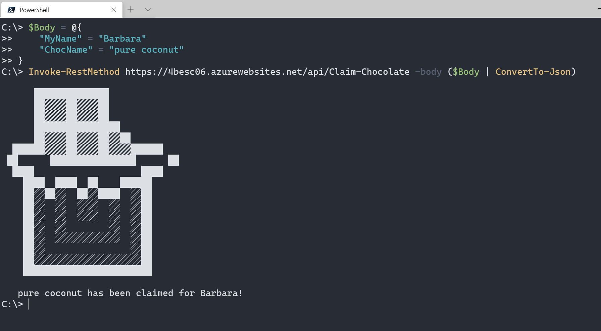
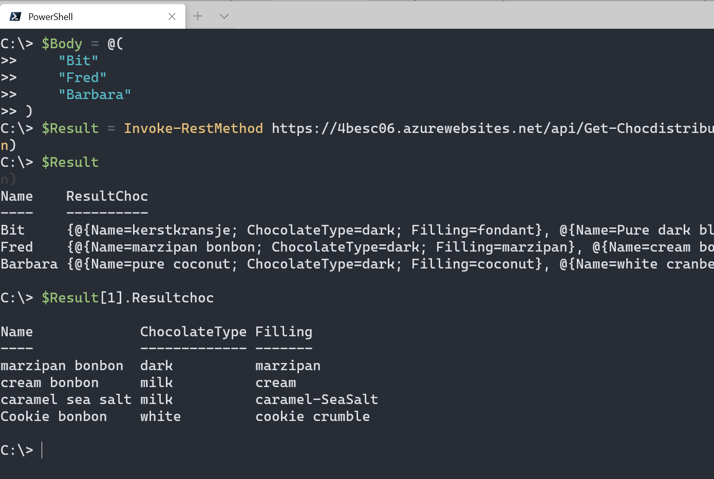

# Challenge 6: The Magic Chocolate Box

For this challenge, durable entities would be great to use. Unfortunately, there is no support for PowerShell yet :(.

So I looked at the options. I often use CosmosDB to store data and again this was the best option for this use case.

## Functionality

With this function, you can add pieces of chocolate to the database. After it has been added, people can claim a piece of chocolate using the Claim-Chocolate API.

When it is time to distribute (or if people want to see all available options), Get-ChocDistribution can be used. This function will check if family members have claimed a piece and assign it to them based on the total amount of pieces. All other pieces are distributed randomly.

## See it in Action

Let's see how it works

### Fill the database with chocolate

The database has been prefilled with the chocolate in zChocklist.json.
To add another piece of chocolate, the following code can be used

```PowerShell
$Body = @{
    Name          = "Cookie bonbon"
    ChocolateType = "white"
    Filling       = "cookie crumble"
    ClaimedBy     = "false"
}
Invoke-RestMethod https://4besc06.azurewebsites.net/api/Add-Chocolate -body ($Body | ConvertTo-Json)
```

### Get available chocolate

For a family member to see what chocolate is still available to claim, the following code can be used

```PowerShell
Invoke-RestMethod https://4besc06.azurewebsites.net/api/Get-UnclaimedChocolate
```



### Claim a piece of chocolate

To claim chocolate for yourself, the function Claim-Chocolate is used with the following format:

```PowerShell
$Body = @{
    "MyName" = "Barbara"
    "ChocName" = "pure coconut"
}

Invoke-RestMethod https://4besc06.azurewebsites.net/api/Claim-Chocolate -body ($Body | ConvertTo-Json)
```

This is also where you can find the ascii art for this entry!  
[Source for the ascii art](https://textart.sh/topic/chocolate) 



### Get the results

When all claimes are done, the organiser of the event can get an overview of all the chocolate distribution.
When calling this, the family members that will get chocolate can be defined in the body.

All unclaimed chocolate is distributed randomly.
So if the organiser is not happy with the results, they are able to run the cmdlet again to get different results!

```PowerShell
$Family = @(
    "Bit"
    "Fred"
    "Barbara"
)

Invoke-RestMethod https://4besc06.azurewebsites.net/api/Get-Chocdistribution -body ($Body | ConvertTo-Json)
```



## The Challenge

This challenge is part of the Seasons of serverless: <https://github.com/microsoft/Seasons-of-Serverless>

original challenge ([source](https://github.com/microsoft/Seasons-of-Serverless/blob/main/Dec-28-2020.md))

Your Chefs: Christopher Maneu, Cloud Advocate, with Abdelmoumene Boumadane and Christopher Chichmanian, Microsoft Student Ambassadors

## This week's featured region: France

Dans certaines familles, autour de Noël, il y a toujours une grosse boîte de chocolats....et il y a toujours un cousin pour vous piquer vos chocolats préférés. Cette année, Nous ne pouvons probablement pas être tous réunis autour d'une même grande boîte, mais nous pouvons préparer des petites boîtes individuelles...il ne reste plus qu'à choisir ses chocolats! 

Développons une solution serverless pour permettre à chaque membre de la famille de choisir les chocolats qu'il désire...mais parmi un choix limité!

---

In some families, around the holiday season, there is always a big box of chocolates on the table, and there's always a little cousin who grabs your favorite one! This year, we can't be together in person but maybe we can prepare little individual boxes for each person. All we have to do is choose the right chocolate for the right person! 

## Your challenge 🍽 

Develop a serverless solution that will allow each family member to let you know their favorite chocolates from your family's limited choice. You might want to reserve your own favorite ones in advance! And you'll need to get creative to divide the chocolates evenly, or according to the individual person's taste (or merit?). Here's a [list of chocolate varieties](https://www.vogue.fr/lifestyle-en/article/the-10-best-parisian-chocolatiers-of-2019) to inspire you.

## Special Santa Secret! 

Ho Ho Ho, try [Durable Entities](https://docs.microsoft.com/en-us/azure/azure-functions/durable/durable-functions-entities?tabs=csharp&WT.mc_id=academic-10922-cxa) for this challenge!

## Resources/Tools Used 🚀

-   **[Visual Studio Code](https://code.visualstudio.com/?WT.mc_id=academic-10922-cxa)**
-   **[Postman](https://www.getpostman.com/downloads/)**
-   **[Azure Functions Extension](https://marketplace.visualstudio.com/items?itemName=ms-azuretools.vscode-azurefunctions&WT.mc_id=academic-10922-cxa)**

## Next Steps 🏃

Learn more about serverless!

  ✅ **[Serverless Free Courses](https://docs.microsoft.com/learn/browse/?term=azure%20functions&WT.mc_id=academic-10922-cxa)**

## Important Resources ⭐️

  ✅ **[Azure Functions documentation](https://docs.microsoft.com/azure/azure-functions/?WT.mc_id=academic-10922-cxa)**
  
  ✅ **[Azure SDK for JavaScript Documentation](https://docs.microsoft.com/azure/javascript/?WT.mc_id=academic-10922-cxa)**
  
  ✅ **[Create your first function using Visual Studio Code](https://docs.microsoft.com/azure/azure-functions/functions-create-first-function-vs-code?WT.mc_id=academic-10922-cxa)**
  
  ✅ **[Free E-Book - Azure Serverless Computing Cookbook, Second Edition](https://azure.microsoft.com/resources/azure-serverless-computing-cookbook/?WT.mc_id=academic-10922-cxa)**

## Ready to submit a solution to this challenge? Here's how 🚀 

Open an [issue](https://github.com/microsoft/Seasons-of-Serverless/issues/new?assignees=&labels=&template=seasons-of-serverless-solution.md&title=Solution) in this repo, with a link to your challenge and a brief explanation of how you solved it. We will take a look, approve it if appropriate, and a tag with the appropriate week. If your solution is picked as a weekly standout solution, we'll send you a little prize!
