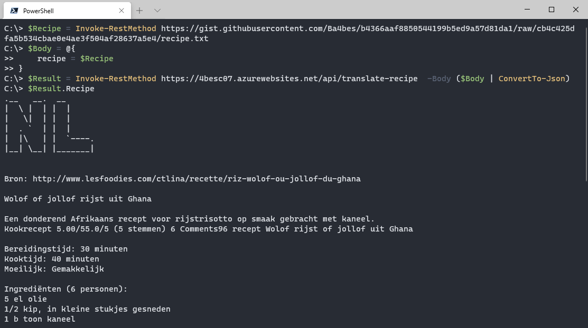

# Challenge 07: The Recipe Connector

Ok, this one needs some explanation 😇.

When the original challenge was posted, I was a bit confused on what I was supposed to do. I thought about it and decided to give my own twist to the challenge! So I made a fun little challenge for myself, based on the original one.

Then, after the challenge was changed, I found that the challenge is now even further from what I had come up with. But at this point I had already written all the code, so I hope this still counts towards the challenge!

## My challenge

So what have I tried to create? I wanted the following:

- an app that takes a recipe in any language as input
- The language of the source is automatically detected
- The callers IP address is used to find the callers country and the language that is spoken there
- The recipe is translated to that language and returned to the caller.

To get this all together, I used Cognitive services, the Azure Maps API and of course a PowerShell function!
For the ascii art, I make use of the artii.herokuapp-API again. A different font this version :)

## Calling the App

To call the app, I found a french recipe (I think, as I don't speak French) for jollof rice! I put in in a gist to improve readability

```PowerShell
$Recipe = Invoke-RestMethod https://gist.githubusercontent.com/Ba4bes/b4366aaf8850544199b5ed9a57d81da1/raw/cb4c425dfa5b534cbae0e4ae3f504af28637a5e4/recipe.txt

$Body = @{
    recipe = $Recipe
}
Invoke-RestMethod https://4besc07.azurewebsites.net/api/translate-recipe  -Body ($Body | ConvertTo-Json)
```

The result for me shows the result in Dutch, as my IP is from the Netherlands. I haven't actually been able to test any other countries, so you might have to test it for me 😁




## Original challenge

(This is the one that my solution was based on)

Source: <https://github.com/microsoft/Seasons-of-Serverless>

[Original file](https://github.com/microsoft/Seasons-of-Serverless/blob/df45a05ca6e1f14196a46724f3fdbbec84e85d67/Jan-4-2021.md)

**Your Chefs: Bethany Jepchumba, Adefemi Afuwape and Felix Omuok, Microsoft Student Ambassadors**

## This week's featured region: Africa

In Africa, city cooks want to reconnect with their country roots. In Kenya, there are many traditional dishes, but no one in Nairobi remembers how to make them! In Lagos, Nigeria, cooks are eager to recreate their grandmother's famous jollof rice, but they can't quite remember the proportions of ingredients. Let's set up a City/Country hotline!

## Your challenge 🍽 

Create a service that will allow a user to send a query for a specific dish to a given relative of your choosing and receive the appropriate and authentic recipe. You could set up a service to call your Grandma to make sure you have the right ingredients for great jollof rice using [Azure Functions bindings for Twilio](https://docs.microsoft.com/en-us/azure/azure-functions/functions-bindings-twilio?tabs=csharp&WT.mc_id=academic-10922-cxa).


## Resources/Tools Used 🚀

-   **[Visual Studio Code](https://code.visualstudio.com/?WT.mc_id=academic-10922-cxa)**
-   **[Postman](https://www.getpostman.com/downloads/)**
-   **[Azure Functions Extension](https://marketplace.visualstudio.com/items?itemName=ms-azuretools.vscode-azurefunctions&WT.mc_id=academic-10922-cxa)**

## Next Steps 🏃

Learn more about serverless!

  ✅ **[Serverless Free Courses](https://docs.microsoft.com/learn/browse/?term=azure%20functions&WT.mc_id=academic-10922-cxa)**

## Important Resources ⭐️

  ✅ **[Azure Functions documentation](https://docs.microsoft.com/azure/azure-functions/?WT.mc_id=academic-10922-cxa)**
  
  ✅ **[Azure SDK for JavaScript Documentation](https://docs.microsoft.com/azure/javascript/?WT.mc_id=academic-10922-cxa)**
  
  ✅ **[Create your first function using Visual Studio Code](https://docs.microsoft.com/azure/azure-functions/functions-create-first-function-vs-code?WT.mc_id=academic-10922-cxa)**
  
  ✅ **[Free E-Book - Azure Serverless Computing Cookbook, Second Edition](https://azure.microsoft.com/resources/azure-serverless-computing-cookbook/?WT.mc_id=academic-10922-cxa)**

## Ready to submit a solution to this challenge? Here's how 🚀 

Open an [issue](https://github.com/microsoft/Seasons-of-Serverless/issues/new?assignees=&labels=&template=seasons-of-serverless-solution.md&title=Solution) in this repo, with a link to your challenge and a brief explanation of how you solved it. We will take a look, approve it if appropriate, and a tag with the appropriate week. If your solution is picked as a weekly standout solution, we'll send you a little prize!
